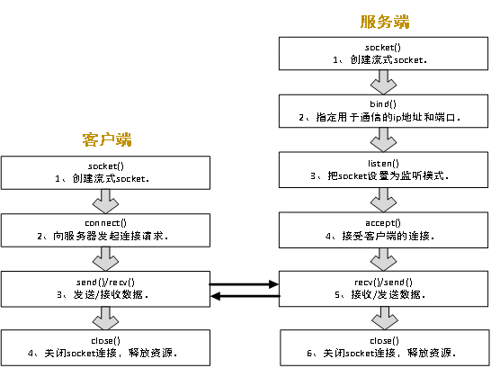

# 第一个网络通讯程序


## 一, 网络通讯的流程



## 二, 客户端代码案例解析

### 1.创建客户端socket

socket函数用于创建一个套接字

第一个参数指明地址族, 例如AF_INET表示使用ipv4地址

第二个参数表示套接字类型, SOCK_STREAM是用于提供序列化, 可靠双向, 基于字节的链接, 与TCP相关联

第三个参数表示协议, 实参为0时表示采用默认协议, 对于SOCK_STREAM来讲, 默认协议即TCP协议

返回值为套接字描述符(非负整数), 可以用该标识符来指明当前的套接字, 当套接字创建失败时则返回-1

```cpp
// 1.创建客户端socket
int sockfd = socket(AF_INET, SOCK_STREAM, 0);
if (sockfd == -1) {
    std::cerr << "socket error" << std::endl;
    return -1;
}
```

### 2.向服务器发起连接请求

```c
hostent* h = gethostbyname(argv[1]); // 用于存放服务端IP的结构体
```

参数中的`name`表示要查询的主机名(用`IP`地址表示), 返回值为类型`hostent`的结构体指针

- 如果查询成功，函数返回一个指向 `hostent` 结构体的指针，该结构体包含了主机的相关信息。
- 如果查询失败，函数返回 `NULL`

```c
// hostent 声明
struct hostent {
    char  *h_name;           // 主机的官方名称
    char **h_aliases;        // 指向主机别名列表的指针数组
    int    h_addrtype;       // 地址类型，例如AF_INET（IPv4）
    int    h_length;         // 地址长度，例如对于IPv4是4
    char **h_addr_list;      // 指向主机地址的指针数组
};
```

```c
// sockaddr_in的声明
struct sockaddr_in {
    sa_family_t sin_family;  // 地址族，对于IPv4，通常是AF_INET
    in_port_t sin_port;      // 端口号，网络字节序
    struct in_addr sin_addr; // IPv4地址，网络字节序
    unsigned char sin_zero[8]; // 保留，用于对齐
};
```

```cpp
int connect(int sockfd, const struct sockaddr *addr, socklen_t addrlen);
```

- `sockfd`：要连接的套接字的文件描述符。
- `addr`：指向一个 `sockaddr` 结构体的指针，该结构体包含了服务器端套接字的地址信息。
- `addrlen`：`addr` 指向的结构体的大小。

连接成功返回0, 连接失败-1

```cpp
// 2.向服务器发起连接请求
hostent* h = gethostbyname(argv[1]); // 用于存放服务端IP的结构体
if (h == 0) {
    std::cerr << "get host failed" << std::endl;
    close(sockfd);
    return -1;
}
sockaddr_in server_addr; // 用于存放服务端IP和端口的结构体。
memset(&server_addr, 0, sizeof(server_addr));
server_addr.sin_family = AF_INET;
memcpy(&server_addr.sin_addr, h->h_addr, (size_t)h->h_length); // 指定服务端的IP地址。
server_addr.sin_port = htons((uint16_t)atoi(argv[2]));         // 指定服务端的通信端口。
// 向服务器发起连接请求
if (connect(sockfd, (sockaddr*)&server_addr, sizeof(server_addr)) != 0) {
    std::cerr << "connect error" << std::endl;
    close(sockfd);
    return -1;
}
```

### 3.连接成功后与服务端通信, 向服务端发送一个报文后等待回复, 然后发送下一个报文

```c
ssize_t send(int sockfd, const void *buf, size_t len, int flags);
```

- `sockfd`：套接字的文件描述符。
- `buf`：指向要发送数据的缓冲区的指针。
- `len`：要发送数据的长度。
- `flags`：通常设置为0，或者可以使用特定的标志来修改发送操作的行为。

如果成功返回发送的字节数，如果出错返回-1


```c
ssize_t recv(int sockfd, void *buf, size_t len, int flags);
```

- `sockfd`：套接字的文件描述符。
- `buf`：指向接收数据的缓冲区的指针。
- `len`：缓冲区的长度。
- `flags`：通常设置为0，或者可以使用特定的标志来修改接收操作的行为。

如果成功，返回接收的字节数; 

如果连接已关闭，返回0; 

如果出错，返回-1

```c
// 3. 连接成功，与服务端通信，向服务端发送一个报文后等待回复，然后发送下一个报文
char buffer[1024];
constexpr size_t ChatSize = 3; // 通讯次数
for (size_t i = 0; i < ChatSize; ++i) {
    std::snprintf(buffer, sizeof(buffer), "这是第条%zu信息, 编号为%zu:", i, i);
    // 发送请求报文
    if (send(sockfd, buffer, strlen(buffer), 0) <= 0) {
        std::cerr << "send failed!" << std::endl;
        break;
    }
    std::cout << "发送" << buffer << std::endl;
    memset(buffer, 0, sizeof(buffer));

    // 接受服务端的回应报文, 如果没有收到则阻塞等待
    if (recv(sockfd, buffer, sizeof(buffer), 0) <= 0) {
        std::cerr << "recv failed" << std::endl;
        break;
    }
    std::cout << "收到" << buffer << std::endl;
    sleep(1);
}
```

